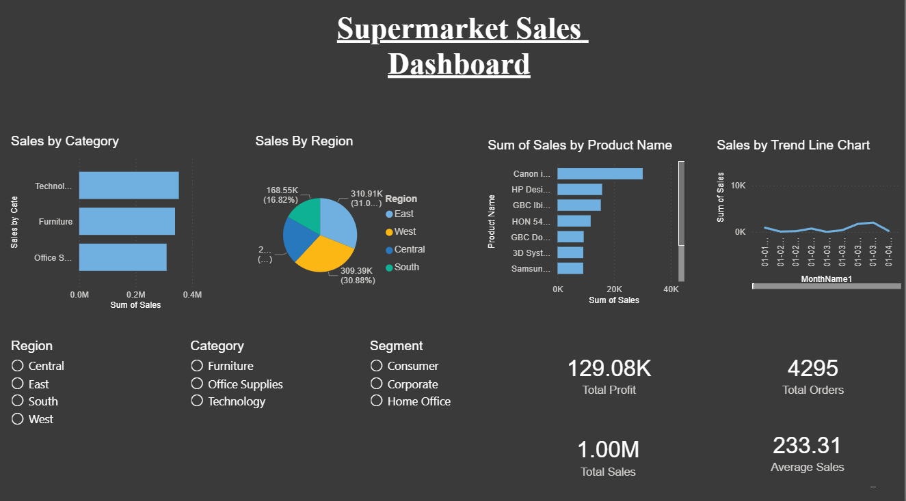

# 📊 Sales Dashboard Team Analysis

## 🔍 Project Overview
This team project focuses on analyzing supermarket sales data to identify trends, patterns, and business insights using data visualization.

## 👥 Team Members
- Hamsini Shetty (Data Analysis & Dashboard Creation)  
- Aslita Saniyola Lasrado (Data Analysis & Dashboard Creation)  

## 📌 My Contribution
- Cleaned and prepared the dataset  
- Built interactive Power BI dashboard  
- Created visualizations for sales trends and category performance  
- Generated insights for decision-making  

## 🛠 Tools Used
- Power BI  
- Excel  

## 📈 Key Insights
- Monthly sales trends and patterns  
- Top-performing product categories  
- Region-wise sales distribution  
- Business recommendations for improving sales  

## 📸 Dashboard Preview

## 📁 Files Included
- `Super_Market_Salesboard.pbix` – Power BI Dashboard  
- `sample_-_superstore.xls` – Dataset  
- `Report_About_Supermarket_Salesanal` – Project Report  

## 🚀 Conclusion
This project helps businesses make data-driven decisions to improve overall sales performance.
